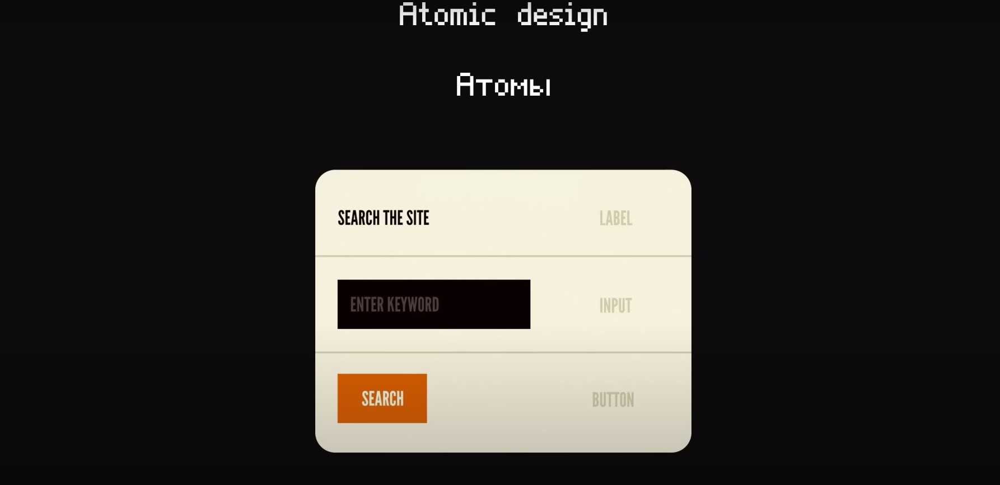
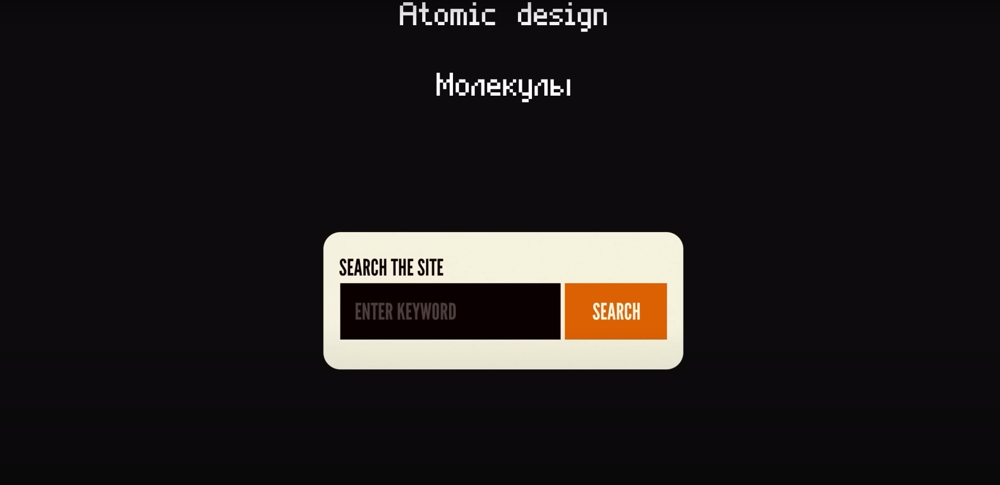
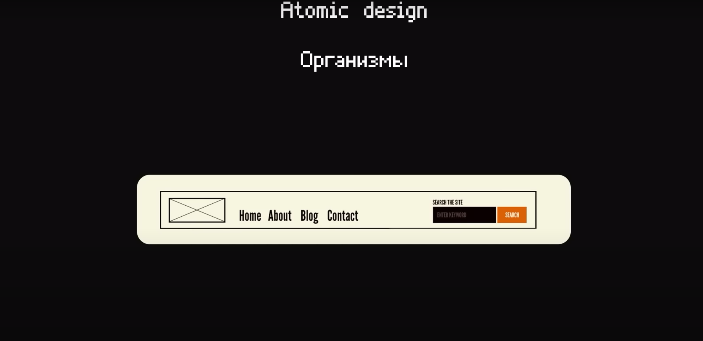
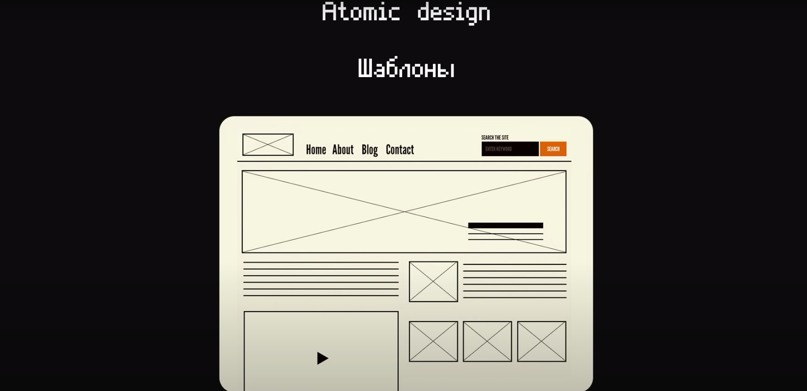
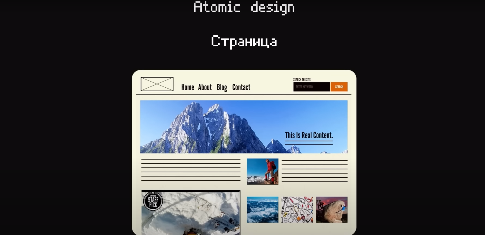

# Атомарный дизайн

- Это очень похожий на модульный архитектурный дизайн, однако со своей спецификой

# Все приложение разделяется на несколько слоев

- Атомы
- Молекулы
- Организмы
- Шаблоны
- Страницы

# Атомы

- Это наш UI слой (Input, Button, Select, Dropdown) переиспользуемые UI компоненты без бизнес-логики
  

# Молекулы

- Более сложные компоненты без бизнес логики как раз так и они клипаются из атомов
  

# Организмы

- Тоже более сложные компоненты если сравнивать с предыдущим то это уже модули и состоят они из бизнес логики, так из молекул
  

# Шаблоны

- Шаблоны задают непосредственно Layout, structure той или иной страницы но без привязки к конкретному контенту (можно считать это абстрактная страница)
  

- И далее используемые эти шаблоны вставляем нам нужные организмы
  
